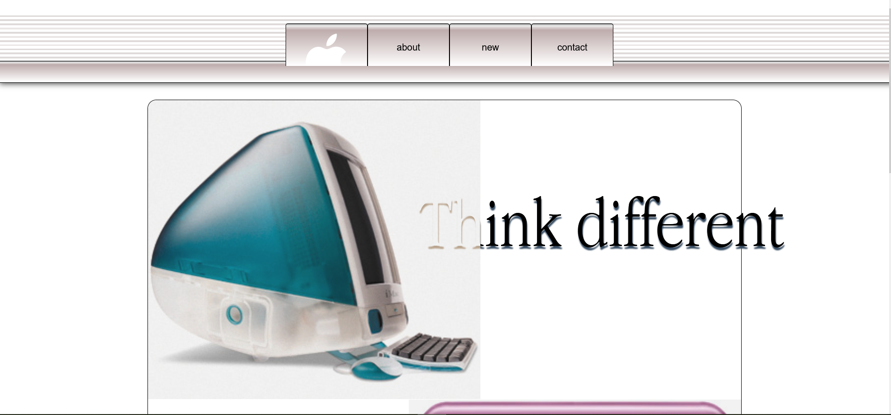
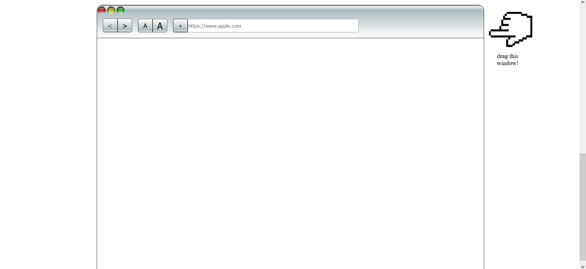

# RETRO IS NEW MODERN App

A Tribute website to apple's old webdesign, also me trying to replicate that design using pure css.

## Demo




## SAFARI WINDOW (MOVABLE AND Closeable)




## Features
-  Has a draggable safari window in it, made using css, JS


## Installation

1. Clone the repository:
   ```bash
   git clone https://github.com/HardikKumariscoding/RetroIsNewModern.git

2.   open the index.html file

 


Technologies Used

    HTML
    JS
    CSS